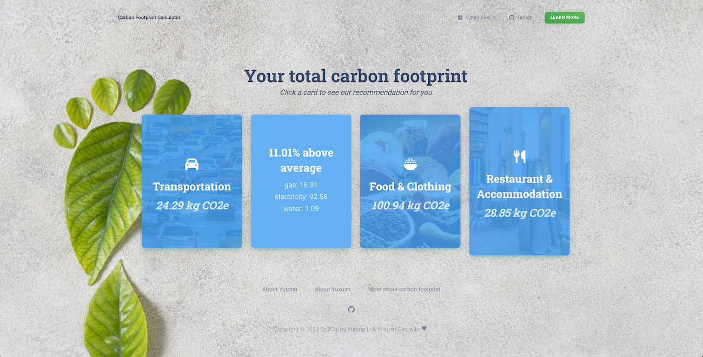
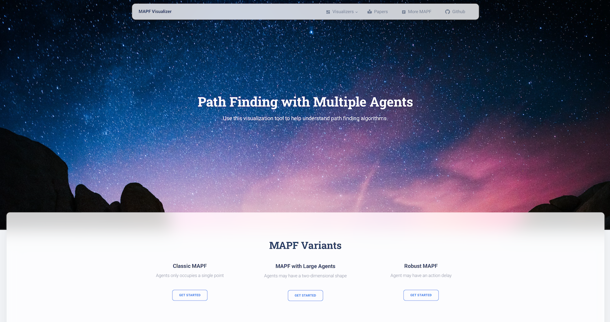
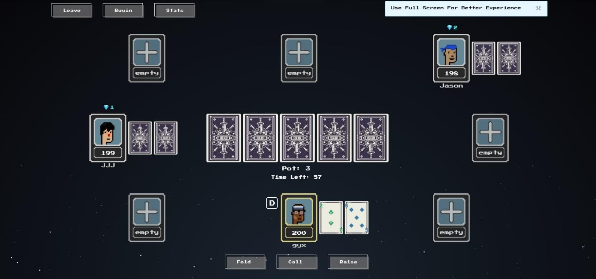

## [Co2Cal](http://52.53.223.36:4000/intro)

_This is a 36-hour hackthon project for Hackteck 2023._

Even though climate change and global warming have been among the hottest topics in recent decades, many people are unaware of the impact their daily activities have on the environment. Without knowing our daily carbon footprint, we may not realize how our lifestyle is impacting the planet.

The principle feature of Co2Cal is to calculate the carbon footprint for each individual based on their activities within four big categories, including consumer goods, home utilities, restaurant & accommodation, and transportation. After receiving users' inputs, Co2Cal will analyze their data and provide customized recommendations for each category to help reduce carbon emission.

## [MAPF Visualizer](http://mapf-visualizer.com)

An animated visualization tool for Multi-Agent Path Finding algorithms. Check out the [MAPF Visualizer section](/mapf-visualizer) for more info.

## [PokerSC](http://pokersc.pro)

This is a Pixel-art style multiplayer Poker gaming website that supports real-time emoji chatting and watch room.

