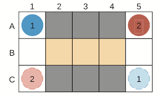
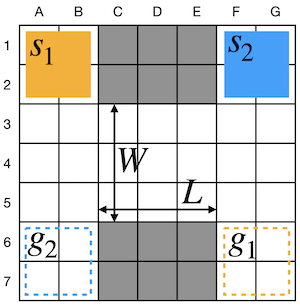
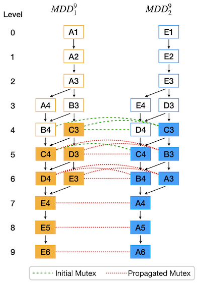
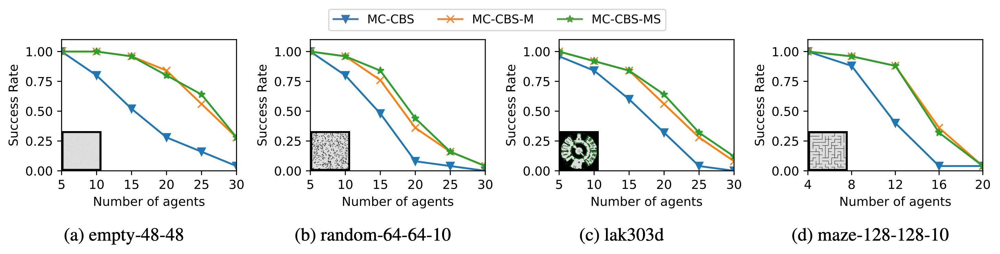

Starting from August 2021, I work as a research assistant at Prof. Sven Koenig's [IDM lab](http://idm-lab.org) at USC.

## Research interests

My research interest lies in developing fundamental algorithms that enable large teams of autonomous agents to act intelligently and safely in dynamic environments. My prior research mainly focus on Multi-Agent Path Finding (MAPF), particularly developing generalizable techniques to identify and reason about symmetries, targeted at several MAPF variants (Large Agent MAPF and k-robust).

## General MAPF

{: .align-right}

In a general MAPF problem, we are given a two-dimensional map of grids where each grid can either be a obstacle (e.g. wall) or a free location. We also have a set of agents: each of them has a start location and a goal location. At each time step, an agent can either move to a neighboring free location or wait in its current location. The task is to return a set of actions for each agent, that will move each of the agents to its goal without conflicting with other agents while minimizing the sum of times used by all agent.

MAPF has practical applications in robotics, video games, vehicle routing, etc. For instance, in automated warehouses, robots are used in place of human workers to collect items from shelves and deliver them to packing area. In such a setting, there are probably hundreds of robots working simultaneously, and it’s crucial to make sure there’s no collision between robots. This problem can easily be generalized to a MAPF model: each robot is an agent, their current location is the start location and their destination (shelves or packing area) is the goal location.

{: .align-right}

## Large Agent MAPF (LA-MAPF)

LA-MAPF is a variant of traditional MAPF. Unlike traditional MAPF where each agent occupies a single point on the 2-dimensional graph, LA-MAPF agents have a geometric shape, i.e. height and width.

## Publication

**Mutex Propagation in Multi-Agent Path Finding for Large Agents** \
 Han Zhang, Yutong Li, Jiaoyang Li, T. K. Satish Kumar and Sven Koenig \
 _The 15th Annual Symposium on Combinatorial Search (**SoCS 2022**)_

{: .align-right}

**Abstract:** Mutex propagation and its concomitant symmetry-breaking techniques are known to be useful in Multi-Agent Path Finding (MAPF) with single-point agents. In this paper, we show that they can be easily generalized to richer MAPF problems. In particular, we demonstrate its application in MAPF with “Large” Agents (LA-MAPF). Here, agents can occupy multiple points at the same time according to their fixed shapes and sizes. While existing rule-based symmetry-breaking techniques are difficult to generalize from single-point agents to large agents, mutex-based symmetry-breaking techniques can be generalized easily. In a Conflict-Based Search (CBS) framework for LA-MAPF, we also develop a mutex-based conflict selection strategy to further enhance the efficiency of search. Through experiments on various maps, we show that our techniques significantly improve MC-CBS, a state-of-the-art optimal LA-MAPF algorithm, in terms of both success rate and runtime.

### Visualization

Please refer to the [MAPF Visualizer page](/mapf-visualizer) for a visualization tool I created.

## Other academic interest

Aside from my research area, I'm also a huge fan of theory of computation. I took Prof. Aaron Cote's CSCI 475: Theory of Computation in Spring 2022, and wrote a project paper titled _[AKS algorithm: a poly-time decider for primality](../assets/my-papers/475_Paper.pdf)_ on the groundbreaking AKS primality testing algorithm.
